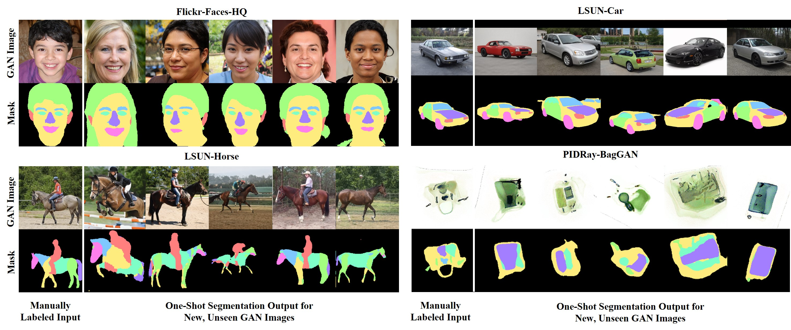
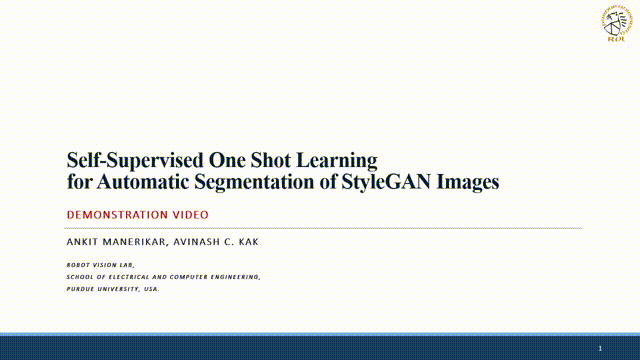
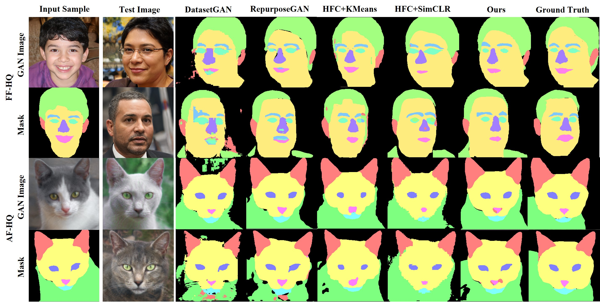
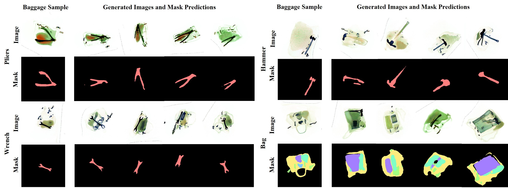

## Self-Supervised One-Shot Learning for Automatic Segmentation of StyleGAN Images

This code provides the implementation, presaved models and on-the-fly segmentation tools for the self-supervised clustering model described in the paper: [Self-Supervised One-Shot Learning for Automatic Segmentation of StyleGAN Images](https://arxiv.org/pdf/2303.05639.pdf).




This code/paper comprises of  a framework for automatic one-shot segmentation of synthetic images generated using StyleGANs. The implementation of this framework is based on the observation that the multi-scale hidden features produced by a GAN during image synthesis hold useful semantic information that can be utilized for automatic segmentation. Using these features, our proposed framework learns to segment synthetic images using a novel self-supervised, contrastive clustering algorithm that projects the hidden features in the generator onto a compact feature space for per-pixel classification. This contrastive learner uses a swapped prediction loss for image segmentation that is computed using pixel-wise cluster assignments for the image and its transformed variants. Using the hidden features from an already pre-trained GAN for clustering, this leads to a much faster learning of the pixel-wise feature vectors for one-shot segmentation.

### Demonstration Video
This video presents a demonstration of on-the-fly one-shot segmentation of StyleGAN images as carried out by our proposed self-supervised model.



[[full video](https://engineering.purdue.edu/RVL/ganecdotes/ganecdotes_demo_ppt.mp4)]

The instructions for the setup, pre-training and fine-tuning the self-supervised learning model as well as for running the GUI are provided below.

The labelling tools used for developing the GUI were adopted from [here](https://github.com/bryandlee/repurpose-gan).

### Requirements

- Python3 (>v3.7.8)
- PyTorch (>v1.7.1)
- torchvision (>v0.8.2)
- CUDA (>v9.2)
- [Apex](https://github.com/NVIDIA/apex)
- Ninja (>v1.10.2)

### Setup and Installation

The code package can be cloned from the git repository using:

```bash
> git clone https://github.com/avm-debatr/ganecdotes.git
```

Before running the segmentation scripts, the following steps must be taken for installation:

#### Anaconda Environment Setup

The conda environment for the code can be created using the `environment.yaml` file provided with the scripts.

```bash
> cd ganecdotes
> conda env create --name ganenv --file=environment.yaml
> conda activate ganenv
```

#### Dependencies

The code uses the NVIDIA's PyTorch Apex extension to apply layerwise rate scaling during network optimization. 
The library can be installed using the steps described [here](https://github.com/facebookresearch/swav/issues/18#issuecomment-748123838).

When running the script, the user may run into a runtime error if the Ninja C++ compiler is not installed with the right build. In this case, the user is suggested to reinstall the compiler  using:

```bash
> sudo apt install ninja-build
```

#### Pre-saved Models and Configurations

To run our pre-training and segmentation scripts, we make use of pre-trained StyleGAN models and datasets which are divided into the following classes:

- *Face* - pretrained on CelebA dataset, tested on FF-HQ, CelebA-MaskHQ dataset
- *Cat*  - pretrained on LSUN-Cat, AF-HQ dataset, tested on Pascal-Part dataset
- *Car*  - pretrained on LSUN-Car dataset, tested on Pascal-Part dataset
- *Horse*  - pretrained on LSUN-Horse dataset, tested on Pascal-Part dataset
- *Bag*  - pretrained and tested on [PIDRay dataset](https://arxiv.org/abs/2211.10763)

To use the different training configurations of these test classes, create a directory `checkpoints/` in the code folder and extract the contents from the [link](https://engineering.purdue.edu/RVL/ganecdotes/checkpoints.tar.gz) into this directory.

To use pre-saved models for one-shot learning for these test classes, extract the contents from this [link](https://engineering.purdue.edu/RVL/ganecdotes/presaved_models.tar.gz) into the `results/` directory.

### Usage

#### Training 

To train the self-supervised model, the user can run the following code:

```bash
> python pretrain.py --model="ffhq-256" --out_dir=results/hfc_ffhq_256 --method=hfc_with_swav --num_test_samples=10 --expt_desc="Training for FF-HQ"
```

This is a script to pre-train self-supervised clustering model for one-shot segmentation. User must specify the
StyleGAN model/ds for pre-training from the following options: 

```
Options: { ffhq-256 | cat-256 | afhq-256 | horse-256 | car-512 |  pidray-256 | pidray-pliers-256 | pidray-hammer-256 | pidray-powerbank-256 | pidray-wrench-256 | pidray-handcuffs-256}
```
and method for self-supervised learning:

```
Options: {hfc_with_swav | hfc_with_simclr | hfc_kmeans}
```
Training parameters are specified in config files saved as `configs/segmentors/*_config.py.` with the respective class name. Parameters for the models are specified in `configs/models/*_config.py.`.  Users can create their own custom config files for their models by adding their path in `configs/mapper.py`. 

#### One-Shot Segmentation

To run the self-supervised model for one-shot learning, the user can run the following code:

```bash
> python evaluate.py --model="ffhq-256" --out_dir=results/hfc_ffhq_256 --method=hfc_with_swav --num_test_samples=10 --expt_desc="One-Shot Learning for FF-HQ"
```

This is a script to run the self-supervised clustering model for one-shot segmentation using a pre-saved model. The directory specified by `out_dir` must contain the `.pt` or `.sav` file for the presaved models in order to run the segmentation routines. The user can specify the StyleGAN model/ds from the following options: 

```
Options: { ffhq-256 | cat-256 | afhq-256 | horse-256 | car-512 |  pidray-256 | pidray-pliers-256 | pidray-hammer-256 | pidray-powerbank-256 | pidray-wrench-256 | pidray-handcuffs-256}
```
and method for self-supervised/semi-supervised learning:

```
Options: {hfc_with_swav | hfc_with_simclr | hfc_kmeans | datasetgan | repurposegan}
```

Training parameters for one-shot learning are specified in `configs/trainers/supervised_config.py`.

#### GUI for the On-the-fly Segmentation

The user can run an interactive GUI to manually label GAN images and perform on-the-fly segmentation for new GAN images. The gui can be run using:

```bash
> python run_on_the_fly_segmentor_gui.py --model="ffhq-256" --out_dir=results/hfc_ffhq_256
```

The labelling tools used for developing the GUI were adopted from [here](https://github.com/bryandlee/repurpose-gan).

### Results 



### BagGAN Framework

The code also includes one-shot segmentation results for the BagGAN framework which is designed for generated synthetic 
images of baggage X-ray scans annotated for prohibited items. The BagGAN framework is trained using the [PIDRay dataset](https://arxiv.org/abs/2211.10763). Further information about the BagGAN framework cna be obtained from its [repository](https://github.com/avm-debatr/bagganhq.git). 



### License
Public Domain, Copyright © 2023, Robot Vision Lab, Purdue University.

### Citation

```
@article{manerikar2023self,
  title={Self-Supervised One-Shot Learning for automatic Segmentation of StyleGAN Images},
  author={Manerikar, Ankit and Kak, Avinash C},
  journal={arXiv preprint arXiv:2303.05639},
  year={2023}
}

```

### Contact

The authors can be contacted at:  amanerik@purdue.edu (Ankit Manerikar)